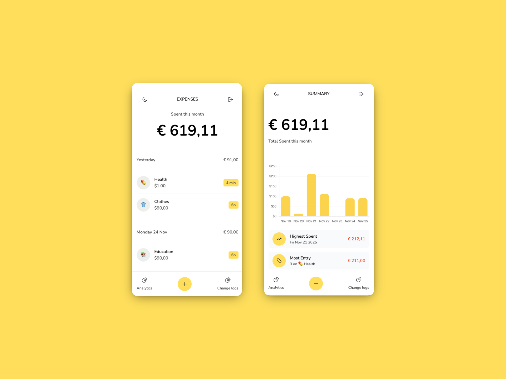

# WorthIt: money = time

WorthIt is an ASP.NET Core MVC web application that helps users track their expenses, manage categories, and analyze their spending. The app uses a SQLite database and Entity Framework Core.


## Features

- Add expenses with amount and category
- Manage categories (name and icon)
- Overview of all expenses
- Analytics and charts for spending (see Analytics)
- Input validation

## Project Structure

- **Controllers/**: Contains controllers for expenses and analytics
- **Models/**: Contains data models such as Expense, Category, User, etc.
- **Views/**: Razor views for the different pages and components
- **Data/**: Database context ([`ApplicationDbContext`](Data/ApplicationDbContext.cs))
- **Migrations/**: Entity Framework migrations
- **wwwroot/**: Static files (CSS, JS, etc.)

## Installation & Usage

1. **Clone the repository**
2. **Apply migrations** (if needed):
   ```sh
   dotnet ef database update
   ```
3. **Run the application**:
   ```sh
   dotnet run
   ```
4. Open your browser at [http://localhost:5243](http://localhost:5243) (or the port specified in `launchSettings.json`).

## Requirements

- [.NET 10.0 SDK](https://dotnet.microsoft.com/)
- SQLite

## Testing

Unit tests are located in the `WorthIt.tests/` folder. Run tests with:
```sh
dotnet test
```
